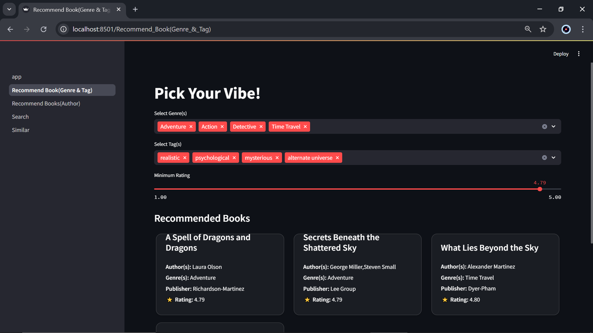
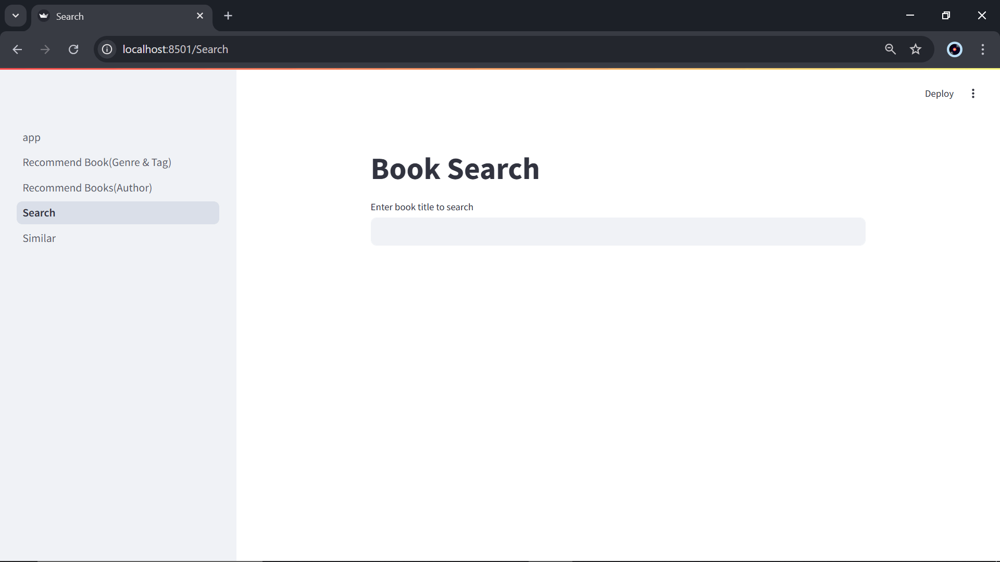
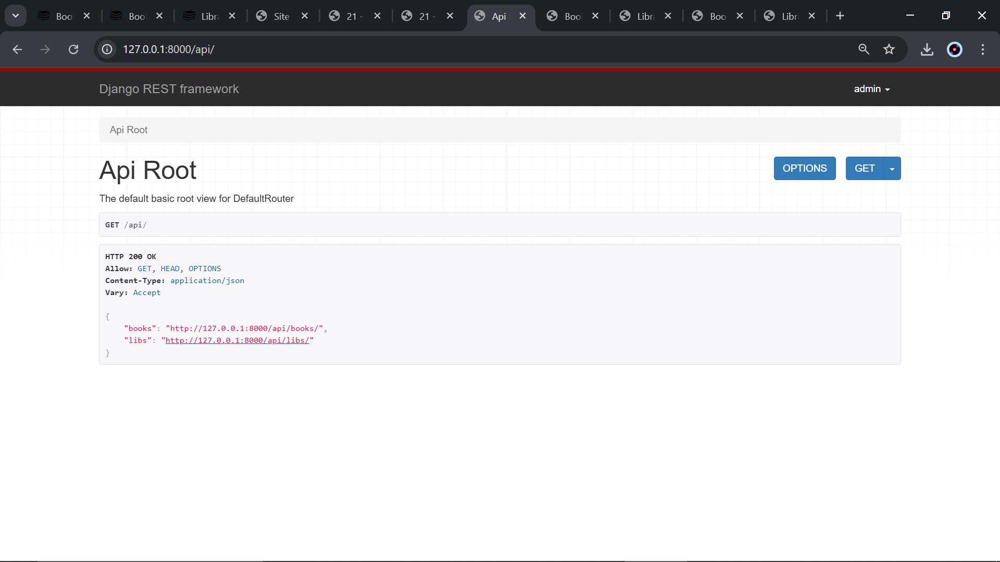

---

# The ShelfOrbit

---

An interactive web application to discover, search, and discuss books seamlessly. Built using Django, Django REST Framework, and React.js, it integrates book discovery, recommendations, and real-time chat into a single platform.

  

---

## Discovering Books

Users can explore personalized book recommendations based on their preferences such as favorite genres, tags, or authors.

### Recommendations based on Themes

  

### Recommendations based on Favorite Authors

  <table>
    <tr>
      <td align="center">
        <strong>Recommendations based on Favorite Author</strong> 
        
      </td>
      <td align="center">
        <strong>Recommendations based on Genre and Tag</strong> 
        
      </td>
    </tr>
  </table>

### Search Books and Get Similar Book Recommendations

Users can search for a book, and the app will suggest books with similar genres, tags, or theme.

  

---

## UI Overview

Explore a curated list of books and dive into detailed insights for each one. The interface offers two main views:

**Book List and Detail View**

  <table>
    <tr>
      <td align="center" width="480">
        <strong>Book List View</strong> 
        
      </td>
      <td align="center" width="480">
        <strong>Book Detail View</strong> 
        
      </td>
    </tr>
  </table>

 **Library List and Detail View**

View all libraries, their locations, and detailed book availability inside each library.

  

---

## Admin Panel - Django

Django Admin panel is used to manage books, libraries, users, and more.

  

---

## API Management - Django REST Framework

APIs are created using Django REST Framework to support frontend integration and external access.

 **API Root View**

Displays the root endpoints available for the API.

  

#### Book & Library API View

  <table>
    <tr>
      <td align="center" width="480">
        <strong>Book API View</strong> 
        
      </td>
      <td align="center" width="480">
        <strong>Library API View</strong> 
        
      </td>
    </tr>
  </table>

---

## Book Discussion Platform 
**Real-time Chat Room**
BookShelf includes a React-based real-time chat platform where users can join discussion rooms and interact.

  <table>
    <tr>
      <td align="center" width="480">
        <strong>Sign In / Sign Out</strong> 
        
      </td>
      <td align="center" width="480">
        <strong>Join or Leave Room</strong> 
        
      </td>
    </tr>
  </table>

#### Book Discussion Rooms

React-based real-time chat room for discussing books with other users.

  

---
---